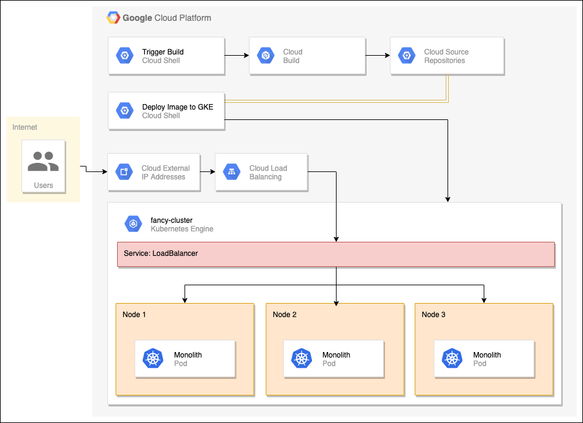

# Lab: Implante, dimensione e atualize seu WebApp no Google Kubernetes Engine

Duração: 1h45min

## Introdução

Executar sites e aplicações é uma tarefa difícil. As coisas dão errado quando não deveriam, os servidores travam, o aumento da demanda faz com que mais recursos sejam utilizados e fazer alterações sem tempo de inatividade é complicado e estressante. Imagine se houvesse uma ferramenta que pudesse te ajudar a fazer tudo isso e até mesmo permitir que você automatizasse. Com o Kubernetes tudo isso não é apenas possível, mas também é fácil.

Neste roteiro de laboratório, você assumirá o papel de desenvolvedor em uma empresa fictícia, a **Fancy Store**, que administra um site de *e-commerce*. Devido a problemas de escalonamento e interrupções, você tem a tarefa de implantar sua aplicação no Google Kubernetes Engine (GKE).

Os exercícios deste laboratório foram ordenados para refletir uma experiência comum de um *cloud developer*:

- Criar um cluster do GKE
- Criar um contêiner do Docker
- Implantar o contêiner no GKE
- Expor o contêiner por meio de um serviço
- Dimensionar o contêiner para várias réplicas
- Modificar o site
- Implantar uma nova versão com tempo de inatividade zero

A arquitetura final pode ser vista abaixo:



## Objetivos

Neste roteiro de laboratório, você aprenderá a realizar as seguintes tarefas:

- Criar um cluster do Google Kubernetes Engine
- Criar uma imagem do Docker
- Implantar imagens do Docker no Kubernetes
- Escalar um aplicativo no Kubernetes
- Executar uma atualização sem interrupção no Kubernetes

## Tarefas

Vamos realizar esse roteiro usando o Cloud Shell. Abra uma sessão Cloud Shell.

Configure uma zona padrão (`us-central1-f`) onde os recursos serão criados:

```
gcloud config set compute/zone us-central1-f
```

### **Tarefa 1.** Crie um *cluster* GKE

Você precisa de um cluster Kubernetes para implantar seu site. Primeiro, certifique-se de que as APIs apropriadas estejam habilitadas.

1. Execute o seguinte comando para ativar a **API Container Registry**:

```
gcloud services enable container.googleapis.com
```

Agora você está pronto para criar um *cluster*!

2. Execute o seguinte comando para criar um *cluster* do GKE chamado `fancy-cluster` com três nós:

```
gcloud container clusters create fancy-cluster --num-nodes 3
```

Levará alguns minutos para que o cluster seja criado.

3. Agora execute o seguinte comando e veja as três instâncias de VM do *cluster*:

```
gcloud compute instances list
```

Você terá uma saída similar a essa:

```
NAME                                          ZONE        MACHINE_TYPE   PREEMPTIBLE  INTERNAL_IP  EXTERNAL_IP    STATUS
gke-fancy-cluster-default-pool-ad92506d-1ng3  us-east4-a  n1-standard-1               10.150.0.7   XX.XX.XX.XX    RUNNING
gke-fancy-cluster-default-pool-ad92506d-4fvq  us-east4-a  n1-standard-1               10.150.0.5   XX.XX.XX.XX    RUNNING
gke-fancy-cluster-default-pool-ad92506d-4zs3  us-east4-a  n1-standard-1               10.150.0.6   XX.XX.XX.XX    RUNNING
```

Encontre seu *cluster* do Kubernetes e informações relacionadas no Cloud Console. Clique no menu **Navegação > Kubernetes Engine > Clusters**. Você deve encontrar o seu *cluster* chamado `fancy-cluster`.

### **Tarefa 2.** Clone o respositório de código-fonte

Como este o site já está desenvolvido, você só precisa clonar o código para então se concentrar na criação de imagens do Docker e na implantação no GKE.

1. Execute os seguintes comandos para clonar o repositório *git* para sua instância do Cloud Shell:

```bash
cd ~
git clone https://github.com/googlecodelabs/monolith-to-microservices.git
```

2. Mude para o diretório apropriado. Você também instalará as dependências do NodeJS para poder testar seu aplicativo antes de implantar:

```bash
cd ~/monolith-to-microservices
./setup.sh
```

Aguarde alguns minutos para que este *script* termine de ser executado.

3. Verifique se você está executando o Cloud Shell com a versão mais recente do `npm`:

```bash
nvm install --lts
```

4. Mude para o diretório apropriado e teste o aplicativo executando o seguinte comando para iniciar o servidor *web*:

```bash
cd ~/monolith-to-microservices/monolith
npm start
```

Saída esperada:

```
Monolith listening on port 8080!
```

Você pode visualizar sua aplicação clicando no ícone de **visualização da web** do Cloud Shell e selecionando **Visualizar na porta 8080**. Isso deve abrir uma nova janela onde você pode ver nossa loja fictícia em ação!

Deixe esta aba aberta, você retornará a ela mais tarde no laboratório. Para interromper o processo do servidor da Web, pressione **CTRL+C** no Cloud Shell.

### **Tarefa 3.** Criar contêiner do Docker com o Cloud Build

Agora que você tem seus arquivos de código-fonte prontos, é hora de *dockerizar* sua aplicação.

Normalmente, você teria que adotar uma abordagem de duas etapas que envolve a criação de um contêiner do Docker e o envio para um registro/repositório para armazenar a imagem para que o GKE pudesse extrair. Podemos facilitar esse processo usando um serviço do Google Cloud chamado **Cloud Build** para construir o container Docker e colocar a imagem no *Container Registry* com um único comando! Com um único comando, você pode construir e mover a imagem para o repositório de contêiner. Para visualizar o processo manual de criação de um arquivo *docker* e enviá-lo por *push*, clique [aqui](https://cloud.google.com/container-registry/docs/quickstart).

O **Google Cloud Build** compactará os arquivos do diretório e os moverá para um *bucket* do *Google Cloud Storage*. O processo de compilação pegará todos os arquivos do *bucket* e usará o *Dockerfile* para executar o processo de compilação do Docker. Como especificamos a sinalização `--tag` com o *host* como `gcr.io` para a imagem do Docker, a imagem do Docker resultante será enviada ao *Google Cloud Container Registry*.

1. Primeiro, para garantir que a API Cloud Build esteja ativada, execute o seguinte comando:

```
gcloud services enable cloudbuild.googleapis.com
```

2. Execute o seguinte para iniciar o processo de compilação:

```bash
cd ~/monolith-to-microservices/monolith
gcloud builds submit --tag gcr.io/${GOOGLE_CLOUD_PROJECT}/monolith:1.0.0 .
```

Este processo levará alguns minutos. Haverá uma saída no terminal semelhante à seguinte:

```
-----------------------------------------------------------------------------------------------------------------------------------------------------------------------------------------------------------
ID                                    CREATE_TIME                DURATION  SOURCE                                                                                  IMAGES                              STATUS
1ae295d9-63cb-482c-959b-bc52e9644d53  2019-08-29T01:56:35+00:00  33S       gs://<PROJECT_ID>_cloudbuild/source/1567043793.94-abfd382011724422bf49af1558b894aa.tgz  gcr.io/<PROJECT_ID>/monolith:1.0.0  SUCCESS
```

Para visualizar seu histórico de compilação ou assistir ao processo em tempo real, clique no menu **Navegação** e role para baixo até a seção Ferramentas e clique em **Cloud Build > Histórico**. Aqui você pode ver uma lista de todas as suas compilações anteriores.

Clique no nome da compilação para ver todos os detalhes dessa compilação, incluindo a saída do *log*.

Opcional: na página de detalhes da compilação, clique em **Resumo da compilação > Detalhes da execução > Nome da imagem** na seção de informações da compilação para ver a imagem do contêiner.

### **Tarefa 4.** Implantar contêiner no GKE

Agora que você conteinerizou seu site e enviou seu contêiner para o *Google Container Registry*, é hora de implantar no Kubernetes!

Para implantar e gerenciar aplicativos em um *cluster* do GKE, você deve se comunicar com o sistema de gerenciamento de *cluster* do Kubernetes. Você normalmente faz isso usando a ferramenta de linha de comando `kubectl`.

Kubernetes representa aplicativos como [pods](https://kubernetes.io/docs/concepts/workloads/pods/pod/), que são unidades que representam um contêiner (ou grupo de contêineres fortemente acoplados). O *pod* é a menor unidade implantável no Kubernetes. Neste laboratório, cada *pod* contém apenas um contêiner monolítico.

Para implantar sua aplicação, crie um recurso de [implantação](https://kubernetes.io/docs/concepts/workloads/controllers/deployment/). A implantação gerencia várias cópias de seu aplicativo, chamadas de réplicas, e as agenda para execução em nós individuais em seu *cluster*. Para este roteiro, a implantação executará apenas um *pod* da sua aplicação. As implantações garantem isso criando um [ReplicaSet](https://kubernetes.io/docs/concepts/workloads/controllers/replicaset/). O ReplicaSet é responsável por garantir que o número de réplicas especificado esteja sempre em execução.

O comando `kubectl create deployment` que você usará em seguida faz com que o Kubernetes crie uma implantação chamada `monolith` em seu *cluster* com **1** réplica.

1. Execute o seguinte comando para implantar sua aplicação:

```
kubectl create deployment monolith --image=gcr.io/${GOOGLE_CLOUD_PROJECT}/monolith:1.0.0
```

### **Tarefa 5.** Verificar implantação

1. Verifique se a implantação foi criada com sucesso:

```
kubectl get all
```

Execute novamente o comando até que o *status* do *pod* seja *Running*.

Saída esperada:

```
NAME                            READY   STATUS    RESTARTS   AGE
pod/monolith-7d8bc7bf68-htm7z   1/1     Running   0          6m21s
NAME                 TYPE        CLUSTER-IP    EXTERNAL-IP   PORT(S)   AGE
service/kubernetes   ClusterIP   10.27.240.1   <none>        443/TCP   24h
NAME                       DESIRED   CURRENT   UP-TO-DATE   AVAILABLE   AGE
deployment.apps/monolith   1         1         1            1           20m
NAME                                  DESIRED   CURRENT   READY   AGE
replicaset.apps/monolith-7d8bc7bf68   1         1         1       20m
```

Esta saída mostra várias coisas:

- A implantação, que é *current*
- O ReplicaSet com contagem de *pods* desejada de 1
- O Pod, que está no estado *Running*

Você também pode visualizar suas implantações do Kubernetes por meio do Cloud Console: **Navegação > Kubernetes Engine > Cargas de trabalho**.

> **Observação**: se você estiver vendo erros ou status inesperados, poderá depurar seus recursos com os seguintes comandos para ver informações detalhadas sobre eles:
```
kubectl describe pod monolith
```
```
kubectl describe pod/monolith-7d8bc7bf68-2bxts
```
```
kubectl describe deployment monolith
```
```
kubectl describe deployment.apps/monolith
```

**Opcional**: você também pode executar comandos para suas implantações separadamente:

```
# Mostrar pods
kubectl get pods
# Mostrar deployments
kubectl get deployments
# Mostrar replica sets
kubectl get rs
# Você também pode combinar os comandos
kubectl get pods,deployments
```

Para ver todos os benefícios do Kubernetes, simule uma falha do servidor excluindo um *pod* e veja o que acontece!

2. Copie um nome de *pod* do comando anterior e use-o ao executar o seguinte comando para excluí-lo:

```
kubectl delete pod/<POD_NAME>
```

Você pode assistir à exclusão na página **Cargas de trabalho** - clicando no nome da carga de trabalho (isso acontecerá rapidamente).

Se você for rápido o suficiente, poderá executar `get all` novamente e deverá ver dois *pods*: um terminando e o outro criando ou executando:

```
kubectl get all
```

Saída esperada:

```
NAME                            READY   STATUS        RESTARTS   AGE
pod/monolith-7d8bc7bf68-2bxts   1/1     Running       0          4s
pod/monolith-7d8bc7bf68-htm7z   1/1     Terminating   0          9m35s
NAME                 TYPE        CLUSTER-IP    EXTERNAL-IP   PORT(S)   AGE
service/kubernetes   ClusterIP   10.27.240.1   <none>        443/TCP   24h
NAME                       DESIRED   CURRENT   UP-TO-DATE   AVAILABLE   AGE
deployment.apps/monolith   1         1         1            1           24m
NAME                                  DESIRED   CURRENT   READY   AGE
replicaset.apps/monolith-7d8bc7bf68   1         1         1       24m
```

Por quê isso aconteceu? O ReplicaSet viu que o *pod* estava terminando e acionou um novo *pod* para manter a contagem de réplicas desejada. Mais tarde, você verá como dimensionar horizontalmente para garantir que haja várias instâncias em execução, portanto, se uma ficar inativa, os usuários não verão nenhum tempo de inatividade!

### **Tarefa 6.** Expor a implantação do GKE

Você implantou seu aplicativo no GKE, mas não há como acessá-lo de fora do *cluster*. Por padrão, os contêineres executados no GKE não podem ser acessados pela Internet porque não têm endereços IP externos. Você deve expor explicitamente seu aplicativo ao tráfego da Internet por meio de um [Service](https://kubernetes.io/docs/concepts/services-networking/service/). Um Service fornece suporte de rede e IP para os *pods* do seu aplicativo. O GKE cria um IP externo e um balanceador de carga para sua aplicação.

1. Execute o seguinte comando para expor sua aplicação à Internet:

```
kubectl expose deployment monolith --type=LoadBalancer --port 80 --target-port 8080
```

2. O GKE atribui o endereço IP externo ao Service, não à implantação. Se você quiser descobrir o IP externo que o GKE provisionou para seu aplicativo, inspecione o serviço com o comando `kubectl get service`:

```
kubectl get service
```

Saída esperada:

```
NAME         CLUSTER-IP      EXTERNAL-IP     PORT(S)          AGE
monolith     10.3.251.122    203.0.113.0     80:30877/TCP     3d
```

Execute novamente o comando até que seu serviço tenha um endereço IP externo.

3. Depois de determinar o endereço IP externo do seu aplicativo, copie o endereço IP e acesse a URL a partir do seu navegador (como `http://203.0.113.0`) para verificar se o aplicativo está acessível.

Você deve ver o mesmo site que testou anteriormente. Agora você tem seu site totalmente rodando no Kubernetes!

### **Tarefa 6.** Escalar a implantação do GKE

Agora que sua aplicação está sendo executada no GKE e exposto à Internet, imagine que seu site se tornou extremamente popular! Você precisa de uma maneira de dimensionar sua aplicação para várias instâncias para que ele possa lidar com todo esse tráfego. A seguir, você aprenderá como dimensionar o aplicativo para até 3 réplicas.

1. No Cloud Shell, execute o seguinte comando para dimensionar sua implantação para até três réplicas:

```
kubectl scale deployment monolith --replicas=3
```

2. Verifique a se a implantação escalou corretamente:

```
kubectl get all
```

Saída esperada:

```
NAME                            READY   STATUS    RESTARTS   AGE
pod/monolith-7d8bc7bf68-2bxts   1/1     Running   0          36m
pod/monolith-7d8bc7bf68-7ds7q   1/1     Running   0          45s
pod/monolith-7d8bc7bf68-c5kxk   1/1     Running   0          45s
NAME                 TYPE           CLUSTER-IP     EXTERNAL-IP    PORT(S)        AGE
service/kubernetes   ClusterIP      10.27.240.1    <none>         443/TCP        25h
service/monolith     LoadBalancer   10.27.253.64   XX.XX.XX.XX   80:32050/TCP   6m7s
NAME                       DESIRED   CURRENT   UP-TO-DATE   AVAILABLE   AGE
deployment.apps/monolith   3         3         3            3           61m
NAME                                  DESIRED   CURRENT   READY   AGE
replicaset.apps/monolith-7d8bc7bf68   3         3         3       61m
```

Agora você deve ver 3 instâncias do seu *pod* em execução. Observe que sua implantação e ReplicaSet agora têm uma contagem desejada de 3.

### **Tarefa 7.** Faça alterações no site

**Cenário**: sua equipe de *marketing* pediu para você alterar a página inicial do seu site. Eles acham que deveria ser mais informativo sobre quem é sua empresa e o que você realmente vende.

**Tarefa**: Você adicionará algum texto à página inicial para deixar a equipe de *marketing* feliz! Parece que um dos desenvolvedores já criou as alterações no arquivo `index.js.new`. Você pode simplesmente copiar este arquivo para `index.js` e as alterações devem ser refletidas. Siga as instruções abaixo para fazer as alterações apropriadas.

1. Execute os seguintes comandos para copiar o arquivo atualizado para o nome de arquivo correto:

```bash
cd ~/monolith-to-microservices/react-app/src/pages/Home
mv index.js.new index.js
```

2. Verifique o conteúdo para confirmar as mudanças:

```bash
cat ~/monolith-to-microservices/react-app/src/pages/Home/index.js
```

Saída esperada:

```js
/*
Copyright 2019 Google LLC
Licensed under the Apache License, Version 2.0 (the "License");
you may not use this file except in compliance with the License.
You may obtain a copy of the License at
    https://www.apache.org/licenses/LICENSE-2.0
Unless required by applicable law or agreed to in writing, software
distributed under the License is distributed on an "AS IS" BASIS,
WITHOUT WARRANTIES OR CONDITIONS OF ANY KIND, either express or implied.
See the License for the specific language governing permissions and
limitations under the License.
*/
import React from "react";
import { makeStyles } from "@material-ui/core/styles";
import Paper from "@material-ui/core/Paper";
import Typography from "@material-ui/core/Typography";
const useStyles = makeStyles(theme => ({
  root: {
    flexGrow: 1
  },
  paper: {
    width: "800px",
    margin: "0 auto",
    padding: theme.spacing(3, 2)
  }
}));
export default function Home() {
  const classes = useStyles();
  return (
    <div className={classes.root}>
      <Paper className={classes.paper}>
        <Typography variant="h5">
          Fancy Fashion &amp; Style Online
        </Typography>
        <br />
        <Typography variant="body1">
          Tired of mainstream fashion ideas, popular trends and societal norms?
          This line of lifestyle products will help you catch up with the Fancy trend and express your personal style.
          Start shopping Fancy items now!
        </Typography>
      </Paper>
    </div>
  );
}
```

Os componentes do React foram atualizados, mas a aplicação React precisa ser construída para gerar os arquivos estáticos.

3. Execute o seguinte comando para compilar o aplicativo React e copiá-lo no diretório público do `monolith`:

```bash
cd ~/monolith-to-microservices/react-app
npm run build:monolith
```

Agora que o código foi atualizado, você precisa reconstruir o contêiner do Docker e publicá-lo no *Google Cloud Container Registry*. Use o mesmo comando anterior, exceto que desta vez atualize a *tag* da versão.

4. Execute o seguinte comando para disparar uma nova compilação no Cloud Build com uma versão de imagem atualizada 2.0.0:

```bash
cd ~/monolith-to-microservices/monolith
```

```
gcloud builds submit --tag gcr.io/${GOOGLE_CLOUD_PROJECT}/monolith:2.0.0 .
```

Na próxima seção, você usará esta imagem para atualizar sua aplicação com tempo de inatividade zero.

### **Tarefa 8.** Atualize o site com tempo zero de inatividade

As alterações foram concluídas e a equipe de *marketing* está feliz com suas atualizações! É hora de atualizar o site sem interrupção para os usuários.

O mecanismo de atualização contínua do GKE garante que seu aplicativo permaneça ativo e disponível mesmo que o sistema substitua instâncias da imagem de contêiner antiga pela nova em todas as réplicas em execução.

1. Informe ao Kubernetes que você deseja atualizar a imagem de sua implantação para uma nova versão com o seguinte comando:

```
kubectl set image deployment/monolith monolith=gcr.io/${GOOGLE_CLOUD_PROJECT}/monolith:2.0.0
```

2. Você pode validar sua atualização de implantação executando o seguinte comando:

```
kubectl get pods
```

Saída esperada:

```
NAME                        READY   STATUS              RESTARTS   AGE
monolith-584fbc994b-4hj68   1/1     Terminating         0          60m
monolith-584fbc994b-fpwdw   1/1     Running             0          60m
monolith-584fbc994b-xsk8s   1/1     Terminating         0          60m
monolith-75f4cf58d5-24cq8   1/1     Running             0          3s
monolith-75f4cf58d5-rfj8r   1/1     Running             0          5s
monolith-75f4cf58d5-xm44v   0/1     ContainerCreating   0          1s
```

Aqui você verá 3 novos *pods* sendo criados e seus *pods* antigos sendo desligados. Você pode dizer pela idade quais são novos e quais são antigos. Eventualmente, você verá apenas 3 *pods* novamente, que serão seus 3 *pods* atualizados.

3. Teste a aplicação executando o seguinte comando para iniciar o servidor *web*:

```
npm start
```

Para verificar nossas alterações, retorne à aba no navegador do aplicativo e atualize a página. Observe que sua aplicação foi atualizada.

Seu site agora deve exibir o texto que você acabou de adicionar ao componente da página inicial! Para interromper o processo do servidor da Web, pressione **CTRL+C** no Cloud Shell.

## Finalize a sua atividade de laboratório

Remova todos os recursos e serviços criados para este roteiro de laboratório.

- Apague o repositório git:

```bash
cd ~
rm -rf monolith-to-microservices
```

- Apague as imagens no *Google Container Registry*:

```
# Apagar versão 1.0.0
gcloud container images delete gcr.io/${GOOGLE_CLOUD_PROJECT}/monolith:1.0.0 --quiet
# Apagar versão 2.0.0
gcloud container images delete gcr.io/${GOOGLE_CLOUD_PROJECT}/monolith:2.0.0 --quiet
```

- Apague os artefatos criados pelo Cloud Build:

```
gcloud builds list | grep 'SOURCE' | cut -d ' ' -f2 | while read line; do gsutil rm $line; done
```

- Apague o Service do GKE:

```
kubectl delete service monolith
kubectl delete deployment monolith
```

- Apague o *cluster* do GKE:

```
gcloud container clusters delete fancy-cluster
```

Digite `Y` para confirmar a ação.


