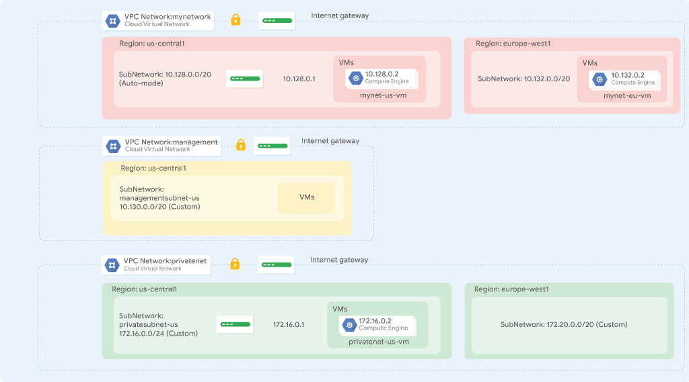

# Lab: Rede VPC

Duração: 2h

## Introdução

A nuvem privada virtual (**VPC** - *virtual private cloud*) do Google Cloud oferece funcionalidades de rede para instâncias de máquina virtual (VM) do *Compute Engine*, contêineres do *Kubernetes Engine* e também para utilização do *AppEngine* (veremos mais a frente). Em outras palavras, sem uma rede VPC, você não pode criar instâncias de VM, contêineres ou aplicativos do App Engine. Portanto, cada projeto do Google Cloud tem uma **rede padrão** (*default*) para você começar.

Você pode pensar em uma rede VPC como algo similar a uma rede física, exceto que ela é virtualizada no Google Cloud. Uma rede VPC é um recurso global que consiste em uma lista de sub-redes virtuais regionais em data centers, todas conectadas por uma rede de longa distância (WAN) global. As redes VPC são logicamente isoladas umas das outras no Google Cloud.

Neste roteiro de laboratório, você irá criar uma rede VPC de modo automático com regras de *firewall* e duas instâncias de VM. Em seguida, você converte a rede de modo automático em uma rede de modo personalizado e cria outras redes de modo personalizado conforme mostrado no diagrama de rede abaixo. Você também testa a conectividade entre redes.



## Objetivos

Neste roteiro de laboratório, você aprenderá a realizar as seguintes tarefas:

- Explorar a rede VPC padrão (*default*);
- Criar uma rede de modo automático com regras de *firewall*;
- Converter uma rede de modo automático em uma rede de modo personalizado;
- Criar redes VPC de modo personalizado com regras de *firewall*;
- Criar instâncias de VM usando o *Compute Engine*;
- Explorar a conectividade de instâncias de VM em redes VPC.

## Tarefas

### **Tarefa 1:** Explore a rede VPC padrão (*default*)

Cada projeto do Google Cloud tem uma rede *default* com sub-redes, rotas e regras de *firewall*.

#### Observe as sub-redes

A rede *default* tem uma sub-rede em cada [região do Google Cloud](https://cloud.google.com/compute/docs/regions-zones/#available).

- No Cloud Console, no menu **Navegação**, clique em **Rede VPC > Redes VPC**.

- Observe a rede *default* com suas sub-redes. Cada sub-rede está associada a uma região do Google Cloud e a um bloco CIDR privado (RFC 1918) para seu **intervalo de endereços IP** internos e um **gateway**.

#### Observe as rotas

As rotas informam às instâncias de VM e à rede VPC como enviar tráfego de uma instância para um destino, seja dentro da rede ou fora do Google Cloud. Cada rede VPC vem com algumas rotas padrão para rotear o tráfego entre suas sub-redes e enviar tráfego de instâncias específicas para a Internet.

- No painel esquerdo, clique em **Rotas**. Observe que há uma rota para cada sub-rede e uma para o **gateway de internet padrão** (`0.0.0.0/0`). Essas rotas são gerenciadas para você, mas você pode criar rotas estáticas personalizadas para direcionar alguns pacotes para destinos específicos. Por exemplo, você pode criar uma rota que envie todo o tráfego de saída para uma instância configurada como um *gateway* NAT.

#### Veja as regras de *firewall*

Cada rede VPC implementa um *firewall* virtual distribuído que você pode configurar. As regras de *firewall* permitem controlar quais pacotes podem trafegar para quais destinos. Cada rede VPC tem duas regras de *firewall* implícitas que bloqueiam todas as conexões de entrada e permitem todas as conexões de saída.

No painel esquerdo, clique em **Firewall**. Observe que existem 4 regras de *firewall* de entrada para a rede *default*:

- default-allow-icmp
- default-allow-rdp
- default-allow-ssh
- default-allow-internal

Essas regras de *firewall* permitem tráfego de entrada **ICMP**, **RDP** e **SSH** de qualquer lugar (`0.0.0.0/0`) e todo o tráfego **TCP**, **UDP** e **ICMP** dentro da rede (`10.128.0.0/9`). As colunas **Destinos**, **Filtros**, **Protocolos/portas** e **Ação** explicam essas regras.

#### Exclua as regras de *firewall*

1. No painel esquerdo, clique em **Firewall**.

2. Selecione todas as regras de *firewall* de rede *default*.

3. Clique em **Excluir**.

4. Clique em **Excluir** para confirmar a exclusão das regras de *firewall*.

#### Excluir a rede *default*

1. No painel esquerdo, clique em **Redes VPC**.

2. Selecione a rede **default**.

3. Clique em **Excluir rede VPC**.

4. Clique em **Excluir** para confirmar a exclusão da rede *default*.

Aguarde até que a rede seja excluída antes de continuar.

5. No painel esquerdo, clique em **Rotas**.

Observe que não há rotas.

6. No painel esquerdo, clique em **Firewall**.

Observe que não há regras de *firewall*.

> **Observação:** sem uma rede VPC, não existem rotas!

#### Tente criar uma instância de VM

Confirme que você não consegue criar uma instância de VM sem uma rede VPC.

1. No menu **Navegação**, clique em **Compute Engine > Instâncias de VM**.

2. Clique em **Criar instância**.

3. Aceite os valores padrão e clique em **Criar**.

Observe o erro.

4. Clique em **Criar instância**.

5. Clique em **Rede, Discos, Segurança, Gerenciamento, Locatário único**.

6. Clique em **Rede**. Observe o erro **Não há mais redes disponíveis** em **Interfaces de rede**.

7. Clique em **Cancelar**.

> **Observação:** conforme o esperado, você não pode criar uma instância de VM sem uma rede VPC!

### **Tarefa 2.** Crie uma rede em modo automático

Nosso objetivo é criar uma rede em modo automático e duas instâncias de VM. As redes em modo automático são fáceis de configurar e usar porque criam sub-redes automaticamente em cada região. No entanto, você não tem controle total sobre as sub-redes criadas em sua rede VPC, incluindo regiões e intervalos de endereços IP usados.

Sinta-se à vontade para explorar mais [opções ao escolher uma rede em modo automático](https://cloud.google.com/vpc/docs/vpc#auto-mode-considerations), mas, por enquanto, suponha que você esteja usando a rede em modo automático para fins de teste e prototipagem.

#### Crie uma rede VPC em modo automático com regras de *firewall*

1. No menu **Navegação**, clique em **Rede VPC > Redes VPC**.

2. Clique em **Criar rede VPC**.

3. Para **Nome**, escolha **mynetwork**.

4. Para o **modo de criação de sub-rede**, escolha **Automática**.

As redes em modo automático criam sub-redes em cada região automaticamente.

5. Para regras de *firewall*, selecione todas as regras disponíveis.

Essas são as mesmas regras de *firewall* padrão que a rede *default* tinha. As regras `deny-all-ingress` e `allow-all-egress` também são exibidas, mas você não pode selecioná-las ou desativá-las porque elas são implícitas. Essas duas regras têm uma **Prioridade** mais baixa (os números inteiros mais altos indicam prioridades mais baixas) para que as regras de permissão ICMP, personalizadas (*custom*), RDP e SSH sejam avaliadas primeiro.

6. Clique em **Criar**.

Quando a nova rede estiver pronta, observe que uma sub-rede foi criada para cada região.

7. Registre o intervalo de endereços IP para as sub-redes em `us-central1` e `europe-west1`.

Estes serão utilizados nas próximas etapas.

> **Observação:** Se você excluir a rede *default*, poderá recriá-la rapidamente criando uma rede de modo automático como acabou de fazer.

#### Crie uma instância de VM em `us-central1`

Crie uma instância de VM na região `us-central1`. A seleção de uma região e zona determina a sub-rede e atribui o endereço IP interno do intervalo de endereços IP daquela sub-rede.

1. No menu **Navegação**, clique em **Compute Engine > Instâncias de VM**.

2. Clique em **Criar instância**.

3. Especifique o seguinte e deixe as configurações restantes como padrão:


| Propriedade | Valor |
|---|---|
| Nome | `mynet-us-vm` |
| Região | us-central1 |
| Zona | us-central1-c |
| Série | N1 |
| Tipo de márquina | n1-standard-1 (1 vCPU, 3,75 GB de memória) |
| Disco de inicialização | Debian GNU/Linux 11 (bullseye) |

4. Clique em **Criar**.

5. Verifique que o IP interno da nova instância foi atribuído no intervalo de endereços IP da sub-rede em `us-central1` (`10.128.0.0/20`).

O IP interno deve ser `10.128.0.2` porque `10.128.0.1` está reservado para o *gateway* e você não configurou nenhuma outra instância nessa sub-rede.

#### Crie uma instância de VM em `europe-west1`

Crie uma instância de VM na região `europe-west1`.

1. Clique em **Criar instância**.

2. Especifique o seguinte e deixe as configurações restantes como padrão:

| Propriedade | Valor |
|---|---|
| Nome | `mynet-eu-vm` |
| Região | europe-west1 |
| Zona | europe-west1-c |
| Série | N1 |
| Tipo de márquina | n1-standard-1 (1 vCPU, 3,75 GB de memória) |
| Disco de inicialização | Debian GNU/Linux 11 (bullseye) |

3. Clique em **Criar**.

4. Verifique que o IP interno da nova instância foi atribuído no intervalo de endereços IP da sub-rede em `europe-west1` (`10.132.0.0/20`).

O IP interno deve ser `10.132.0.2` porque `10.132.0.1` está reservado para o *gateway* e você não configurou nenhuma outra instância nessa sub-rede.

> **Observação:** os **endereços IP externos** para ambas as instâncias de VM são **efêmeros**. Se uma instância for interrompida, todos os endereços IP externos temporários atribuídos à instância serão liberados novamente no *pool* geral do *Compute Engine* e ficarão disponíveis para uso por outros projetos. Quando uma instância interrompida é iniciada novamente, um novo endereço IP externo efêmero é atribuído à instância. Como alternativa, você pode reservar um endereço IP externo estático, que atribui o endereço ao seu projeto indefinidamente até que você o libere explicitamente.

#### Verificando a conectividade das instâncias de VM

As regras de *firewall* que você criou com **mynetwork** permitem a entrada de tráfego SSH e ICMP de dentro de **mynetwork** (IP interno) e de fora dessa rede (IP externo).

1. No menu Navegação, clique em **Compute Engine > Instâncias de VM**.

Observe os endereços IP externos e internos para **mynet-eu-vm**.

2. Para **mynet-us-vm**, clique em SSH para iniciar um terminal e se conectar.

> Você pode se conectar via SSH devido à regra de *firewall* **allow-ssh**, que permite tráfego de entrada de qualquer lugar (`0.0.0.0/0`) para **tcp:22**. A conexão SSH funciona perfeitamente porque o *Compute Engine* gera uma chave SSH para você e a armazena na instância.

3. Para testar a conectividade com o IP interno de `mynet-eu-vm`, execute o seguinte comando, substituindo o IP interno de `mynet-eu-vm`:

```
ping -c 3 <IP interno de mynet-eu-vm>
```

Você pode executar um `ping` ao IP interno de `mynet-eu-vm` devido a regra de *firewall* **allow-custom**.

4. Para testar a conectividade com o IP externo de `mynet-eu-vm`, execute o seguinte comando, substituindo o IP externo de `mynet-eu-vm`:

```
ping -c 3 <IP externo de mynet-eu-vm>
```

> **Observação:** Você pode se conectar por SSH em `mynet-us-vm` e pingar os endereços IP internos e externos de `mynet-eu-vm` conforme o esperado. Alternativamente, você pode se conectar por SSH em `mynet-eu-vm` e pingar os endereços IP internos e externos de `mynet-us-vm`, o que também funciona.

#### Converta a rede em uma rede de modo personalizado

A rede em modo automático funcionou muito bem até agora, mas você foi solicitado a convertê-la em uma rede de modo personalizado para que novas sub-redes não sejam criadas automaticamente à medida que novas regiões se tornam disponíveis. Isso pode resultar em sobreposição com endereços IP usados por sub-redes ou rotas estáticas criadas manualmente, ou pode interferir no planejamento geral da rede.

1. No menu Navegação, clique em **Rede VPC > Redes VPC**.

2. Clique em **mynetwork** para abrir os detalhes da rede.

3. Clique em **Editar**.

4. Selecione **Personalizado** para o **modo de criação da sub-rede**.

5. Clique em **Salvar**.

6. Retorne à página de **redes VPC**.

Aguarde o **Modo** de **mynetwork** mudar para **Personalizado**.

Você pode clicar em **Atualizar** enquanto espera.

> **Observação:** Converter uma rede de modo automático em uma rede de modo personalizado é uma tarefa fácil e oferece mais flexibilidade. É recomendado que você use redes de modo personalizado em produção.

### **Tarefa 3.** Crie redes em modo personalizado

Você foi encarregado de criar duas redes personalizadas adicionais, **managementnet** e **privatenet**, juntamente com regras de *firewall* que permitem tráfego de entrada **SSH**, **ICMP** e **RDP**, além de novas instâncias de VM, conforme mostrado neste diagrama: 


Observe que os intervalos IP dessas redes não se sobrepõem. Isso permite que você configure mecanismos como o *peering* VPC entre as redes. Se você especificar intervalos IP diferentes da sua rede local, poderá até configurar a conectividade híbrida usando VPN ou o *Cloud Interconnect*.

#### Crie a rede `managementnet`

Crie a rede **managementnet** usando o Cloud Console.

1. No Cloud Console, no menu **Navegação**, clique em **Rede VPC > Redes VPC**.

2. Clique em **Criar rede VPC**.

3. Em **Nome**, insira **managementnet**

4. Para o **modo de criação da sub-rede**, clique em **Personalizado**.

5. Clique em **Nova sub-rede** e especifique o seguinte e deixe as configurações restantes como padrão:

| Propriedade | Valor |
|---|---|
| Nome | managementsubnet-us |
| Região | us-central1 |
| Intervalo IPv4 | `10.130.0.0/20` |

6. Clique em **Concluir**.

7. Clique em **Linha de comando equivalente**.

Esses comandos ilustram que redes e sub-redes podem ser criadas usando a linha de comando através do `gcloud`. Você criará a rede `privatenet` usando esses comandos com parâmetros semelhantes.

8. Clique em **Fechar**.

9. Clique em **Criar**.

#### Crie a rede `privatenet`

Crie a rede **privatenet** usando a linha de comando `gcloud`.

1. No Cloud Console, clique em **Ativar o Cloud Shell**.

2. Se solicitado, clique em **Continuar**.

3. Para criar a rede **privatenet**, execute o seguinte comando. Clique em **Autorizar** se solicitado.

```
gcloud compute networks create privatenet --subnet-mode=custom
```

4. Para criar a sub-rede **privatesubnet-us**, execute o seguinte comando:

```
gcloud compute networks subnets create privatesubnet-us --network=privatenet --region=us-central1 --range=172.16.0.0/24
```

5. Para criar a sub-rede **privatesubnet-eu**, execute o seguinte comando:

```
gcloud compute networks subnets create privatesubnet-eu --network=privatenet --region=europe-west1 --range=172.20.0.0/20
```

6. Para listar as redes VPC disponíveis, execute o seguinte comando:

```
gcloud compute networks list
```

A saída deve ficar assim:

```
NAME           SUBNET_MODE  BGP_ROUTING_MODE  IPV4_RANGE  GATEWAY_IPV4
managementnet  CUSTOM       REGIONAL
mynetwork      CUSTOM       REGIONAL
privatenet     CUSTOM       REGIONAL
```

7. Para listar as sub-redes VPC disponíveis (classificadas por rede VPC), execute o seguinte comando:

```
gcloud compute networks subnets list --sort-by=NETWORK
```

A saída deve ficar assim:

```
NAME                REGION                  NETWORK       RANGE
managementsubnet-us us-central1             managementnet 10.130.0.0/20
mynetwork           us-central1             mynetwork     10.128.0.0/20
mynetwork           europe-west1            mynetwork     10.132.0.0/20
mynetwork           us-west1                mynetwork     10.138.0.0/20
mynetwork           asia-east1              mynetwork     10.140.0.0/20
mynetwork           us-east1                mynetwork     10.142.0.0/20
mynetwork           asia-northeast1         mynetwork     10.146.0.0/20
mynetwork           asia-southeast1         mynetwork     10.148.0.0/20
mynetwork           us-east4                mynetwork     10.150.0.0/20
mynetwork           australia-southeast1    mynetwork     10.152.0.0/20
mynetwork           europe-west2            mynetwork     10.154.0.0/20
mynetwork           europe-west3            mynetwork     10.156.0.0/20
mynetwork           southamerica-east1      mynetwork     10.158.0.0/20
mynetwork           asia-south1             mynetwork     10.160.0.0/20
mynetwork           northamerica-northeast1 mynetwork     10.162.0.0/20
mynetwork           europe-west4            mynetwork     10.164.0.0/20
mynetwork           europe-north1           mynetwork     10.166.0.0/20
mynetwork           us-west2                mynetwork     10.168.0.0/20
mynetwork           asia-east2              mynetwork     10.170.0.0/20
mynetwork           europe-west6            mynetwork     10.172.0.0/20
mynetwork           asia-northeast2         mynetwork     10.174.0.0/20
mynetwork           asia-northeast3         mynetwork     10.178.0.0/20
mynetwork           us-west3                mynetwork     10.180.0.0/20
mynetwork           us-west4                mynetwork     10.182.0.0/20
mynetwork           asia-southeast2         mynetwork     10.184.0.0/20
mynetwork           europe-central2         mynetwork     10.186.0.0/20
privatesubnet-eu    europe-west1            privatenet    172.20.0.0/20
privatesubnet-us    us-central1             privatenet    172.16.0.0/24
```

> **Observação**: As redes `managementnet` e `privatenet` têm apenas as sub-redes que você criou porque são redes de modo personalizado. A rede `mynetwork` também é uma rede de modo personalizado, mas começou como uma rede de modo automático, resultando em sub-redes em cada região.

8. No Cloud Console, no menu **Navegação**, clique em **Rede VPC > Redes VPC**. Verifique se as mesmas redes e sub-redes estão listadas no Cloud Console.

#### Crie as regras de *firewall* para `managementnet`

Crie regras de *firewall* para permitir tráfego de entrada **SSH**, **ICMP** e **RDP** para instâncias de VM na rede **managementnet**.

1. No Cloud Console, no menu **Navegação**, clique em **Rede VPC > Firewall**.

2. Clique em **Criar regra de firewall**.

3. Especifique o seguinte e deixe as configurações restantes como padrão:

| Propriedade | Valor |
|---|---|
| Nome | managementnet-allow-icmp-ssh-rdp |
| Rede | managementnet |
| Destinos | Todas as instâncias na rede |
| Filtro de origem | Intervalos IPv4 |
| Intervalos IPv4 de origem | `0.0.0.0/0` |
| Protocolos e portas | Portas e protocolos especificados |

> **Observação**: certifique-se de incluir o /0 nos intervalos de IPv4 de origem para especificar todas as redes.

4. Selecione **tcp** e especifique as portas **22** e **3389**.

5. Selecione **Outros protocolos** e especifique o protocolo **icmp**.

6. Clique em **Linha de comando equivalente**.

Esses comandos ilustram que as regras de *firewall* também podem ser criadas usando a linha de comando `gcloud`. Você criará as regras de *firewall* da `privatenet` usando esses comandos com parâmetros semelhantes.

7. Clique em **Fechar**.

8. Clique em **Criar**.

#### Crie as regras de *firewall* para `privatenet`

Crie as regras de *firewall* para a rede **privatenet** usando a linha de comando `gcloud`.

1. Retorne ao Cloud Shell. Se necessário, clique em **Ativar o Cloud Shell**.

2. Para criar a regra de *firewall* **privatenet-allow-icmp-ssh-rdp**, execute o seguinte comando:

```
gcloud compute firewall-rules create privatenet-allow-icmp-ssh-rdp --direction=INGRESS --priority=1000 --network=privatenet --action=ALLOW --rules=icmp,tcp:22,tcp:3389 --source-ranges=0.0.0.0/0
```

A saída deve ficar assim:

```
NAME                           NETWORK     DIRECTION  PRIORITY  ALLOW                 DENY
privatenet-allow-icmp-ssh-rdp  privatenet  INGRESS    1000      icmp,tcp:22,tcp:3389
```

3. Para listar todas as regras de *firewall* (classificadas por rede VPC), execute o seguinte comando:

```
gcloud compute firewall-rules list --sort-by=NETWORK
```

A saída deve ficar assim:

```
NAME                              NETWORK        DIRECTION  PRIORITY  ALLOW                        
managementnet-allow-icmp-ssh-rdp  managementnet  INGRESS    1000      icmp,tcp:22,tcp:3389
mynetwork-allow-icmp              mynetwork      INGRESS    1000      icmp
mynetwork-allow-internal          mynetwork      INGRESS    65534     all                         
mynetwork-allow-rdp               mynetwork      INGRESS    1000      tcp:3389
mynetwork-allow-ssh               mynetwork      INGRESS    1000      tcp:22
privatenet-allow-icmp-ssh-rdp     privatenet     INGRESS    1000      icmp,tcp:22,tcp:3389
```

As regras de *firewall* para a rede **mynetwork** foram criadas para você. Você pode definir vários protocolos e portas em uma regra de *firewall* (**privatenet** e **managementnet**) ou distribuí-los por várias regras (**default** e **mynetwork**).

4. No Cloud Console, no menu **Navegação**, clique em **Rede VPC > Firewall**. Verifique se as mesmas regras de *firewall* estão listadas no Cloud Console. Clique em **Atualizar** se você não vir a regra **privatenet-allow-icmp-ssh-rdp**.

No próximo passo, vamos criar duas instâncias de VM:

- **managementnet-us-vm** em **managementsubnet-us**
- **privatenet-us-vm** em **privatesubnet-us**

#### Crie a instância `managementnet-us-vm`

Crie a instância **managementnet-us-vm** usando o Cloud Console.

1. No Cloud Console, no menu **Navegação**, clique em **Compute Engine > Instâncias de VM**.

2. Clique em Criar instância.

3. Especifique o seguinte e deixe as configurações restantes como padrão:

| Propriedade | Valor |
|---|---|
| Nome | `managementnet-us-vm` |
| Região | us-central1 |
| Zona | us-central1-c |
| Série | N1 |
| Tipo de márquina | f1-micro (1 vCPU, 614 MB de memória) |
| Disco de inicialização | Debian GNU/Linux 11 (bullseye) |

4. Clique em **Rede, Discos, Segurança, Gerenciamento, Locatário único**.

5. Clique em **Rede**.

6. Para **interfaces de rede**, clique na seta para editar.

7. Especifique o seguinte e deixe as configurações restantes como padrão:

| Propriedade | Valor |
|---|---|
| Rede | managementnet |
| Sub-rede | managementsubnet-us |

> **Observação**: As sub-redes disponíveis para seleção são restritas àquelas na região selecionada (`us-central1`).

8. Clique em **Concluir**.

9. Clique em **Linha de Comando Equivalente**.

Isso ilustra que as instâncias de VM também podem ser criadas usando a linha de comando `gcloud`. Você criará a instância **privatenet-us-vm** usando esses comandos com parâmetros semelhantes.

10. Clique em **Fechar**.

11. Clique em **Criar**.

#### Crie a instância `privatenet-us-vm`

Crie a instância **privatenet-us-vm** usando a linha de comando `gcloud`.

1. Retorne ao Cloud Shell. Se necessário, clique em **Ativar o Cloud Shell**.

2. Para criar a instância **privatenet-us-vm**, execute o seguinte comando:

```
gcloud compute instances create privatenet-us-vm --zone=us-central1-c --machine-type=f1-micro --subnet=privatesubnet-us --image-family=debian-10 --image-project=debian-cloud --boot-disk-size=10GB --boot-disk-type=pd-standard --boot-disk-device-name=privatenet-us-vm
```

A saída deve ficar assim:

```
NAME              ZONE           MACHINE_TYPE  PREEMPTIBLE  INTERNAL_IP  EXTERNAL_IP    STATUS
privatenet-us-vm  us-central1-c  f1-micro                   172.16.0.2   34.66.197.202  RUNNING
```

3. Para listar todas as instâncias de VM (classificadas por zona), execute o seguinte comando:

```
gcloud compute instances list --sort-by=ZONE
```

A saída deve ficar assim:

```
NAME                 ZONE            MACHINE_TYPE  PREEMPTIBLE  INTERNAL_IP  EXTERNAL_IP    STATUS
mynet-eu-vm          europe-west1-c  n1-standard-1              10.132.0.2   34.76.115.41   RUNNING
managementnet-us-vm  us-central1-c   f1-micro                   10.130.0.2   35.239.68.123  RUNNING
mynet-us-vm          us-central1-c   n1-standard-1              10.128.0.2   35.202.101.52  RUNNING
privatenet-us-vm     us-central1-c   f1-micro                   172.16.0.2   34.66.197.202  RUNNING
```

4. No Cloud Console, no menu **Navegação**, clique em **Compute Engine > Instâncias de VM**. Verifique se as instâncias de VM estão listadas no Cloud Console.

5. Nas **Colunas**, ordene por **Zona**.

Existem três instâncias em **us-central1-c** e uma instância em **europe-west1-c**. No entanto, essas instâncias estão espalhadas por três redes VPC (**managementnet**, **mynetwork** e **privatenet**), sem nenhuma instância na mesma zona e rede que outra. Na próxima tarefa, você irá explorar o efeito que isso tem na conectividade interna.

> **Observação**: você pode explorar mais informações de rede em cada instância de VM clicando no link **nic0** na coluna **IP interno**. A página de detalhes da interface de rede resultante mostra a sub-rede junto com o intervalo IP, as regras e rotas de *firewall* que se aplicam à instância e outras análises de rede.

### **Tarefa 4:** Explore a conectividade entre as redes

Explore a conectividade entre as instâncias de VM. Especificamente, determine o efeito de ter instâncias de VM na mesma zona em contraste a ter instâncias na mesma rede VPC.

#### Execute um `ping` nos endereços IP externos

Execute um `ping` nos endereços IP externos das instâncias de VM para determinar se você pode acessar as instâncias a partir da Internet.

1. No Cloud Console, no menu **Navegação**, clique em **Compute Engine > Instâncias de VM**. Observe os endereços IP externos para **mynet-eu-vm**, **managementnet-us-vm** e **privatenet-us-vm**.

2. Para **mynet-us-vm**, clique em **SSH** para iniciar um terminal e se conectar.

3. Para testar a conectividade com o IP externo de **mynet-eu-vm**, execute o seguinte comando, substituindo o IP externo de **mynet-eu-vm**:

```
ping -c 3 <IP externo de mynet-eu-vm>
```

Este `ping` deve funcionar!

4. Para testar a conectividade com o IP externo do **managementnet-us-vm**, execute o seguinte comando, substituindo o IP externo de **managementnet-us-vm**:

```
ping -c 3 <IP externo de managementnet-us-vm>
```

Este `ping` deve funcionar!

5. Para testar a conectividade com o IP externo de **privatenet-us-vm**, execute o seguinte comando, substituindo o IP externo de privatenet-us-vm:

```
ping -c 3 <IP externo de privatenet-us-vm>
```

Este `ping` deve funcionar!

> **Observação**: você pode executar um `ping` no endereço IP externo de todas as instâncias de VM, mesmo que estejam em uma zona ou rede VPC diferente. Isso confirma que o acesso público a essas instâncias é controlado apenas pelas regras de *firewall* ICMP que você estabeleceu anteriormente.

#### Execute um `ping` nos endereços IP internos

Execute um `ping` nos endereços IP internos das instâncias de VM para determinar se você pode acessar as instâncias de dentro de uma rede VPC.

1. No Cloud Console, no menu **Navegação**, clique em **Compute Engine > Instâncias de VM**. Observe os endereços IP internos para **mynet-eu-vm**, **managementnet-us-vm** e **privatenet-us-vm**.

2. Retorne ao terminal **SSH** para **mynet-us-vm**.

3. Para testar a conectividade com o IP interno de **mynet-eu-vm**, execute o seguinte comando, substituindo o IP interno de **mynet-eu-vm**:

```
ping -c 3 <IP interno de mynet-eu-vm>
```

> **Observação**: você pode executar um `ping` no endereço IP interno de **mynet-eu-vm** porque está na mesma rede VPC que a origem do ping (**mynet-us-vm**), mesmo que ambas as instâncias de VM estejam em zonas, regiões e continentes diferentes!

4. Para testar a conectividade com o IP interno de **managementnet-us-vm**, execute o seguinte comando, substituindo o IP interno de **managementnet-us-vm**:

```
ping -c 3 <IP interno de managementnet-us-vm>
```

> **Nota**: Isso não deve funcionar, conforme indicado por uma perda de pacotes de 100%!

5. Para testar a conectividade com o IP interno de **privatenet-us-vm**, execute o seguinte comando, substituindo o IP interno de **privatenet-us-vm**:

```
ping -c 3 <IP interno de privatenet-us-vm>
```

> **Nota**: Isso também não deve funcionar, conforme indicado por uma perda de pacotes de 100%! Você não pode executar um `ping` no endereço IP interno de **managementnet-us-vm** e **privatenet-us-vm** porque eles estão em redes VPC separadas da origem do *ping* (**mynet-us-vm**), mesmo que estejam todos na mesma zona, `us-central1-c`.

### **Tarefa 5:** Revisão

Neste roteiro de laboratório, você explorou a rede *default* e determinou que não pode criar instâncias de VM sem uma rede VPC. Assim, você criou uma nova rede VPC de modo automático com sub-redes, rotas, regras de *firewall*, duas instâncias de VM e testou a conectividade das instâncias de VM. Como as redes de modo automático não são recomendadas para produção, você converteu a rede de modo automático em uma rede de modo personalizado.

Em seguida, você criou mais duas redes VPC de modo personalizado com regras de *firewall* e instâncias de VM usando o Cloud Console e a linha de comando `gcloud`. Em seguida, você testou a conectividade entre redes VPC, que funcionou ao fazer um `ping` de endereços IP externos, mas não ao fazer um `ping` de endereços IP internos.

As redes VPC são, por padrão, domínios isolados de rede privada. Portanto, nenhuma comunicação de endereço IP interno é permitida entre redes, a menos que você configure mecanismos como *peering* de VPC ou VPN.

## Finalize a sua atividade de laboratório

Exclua todas as instâncias de VM e redes VPC criadas para este roteiro de laboratório.